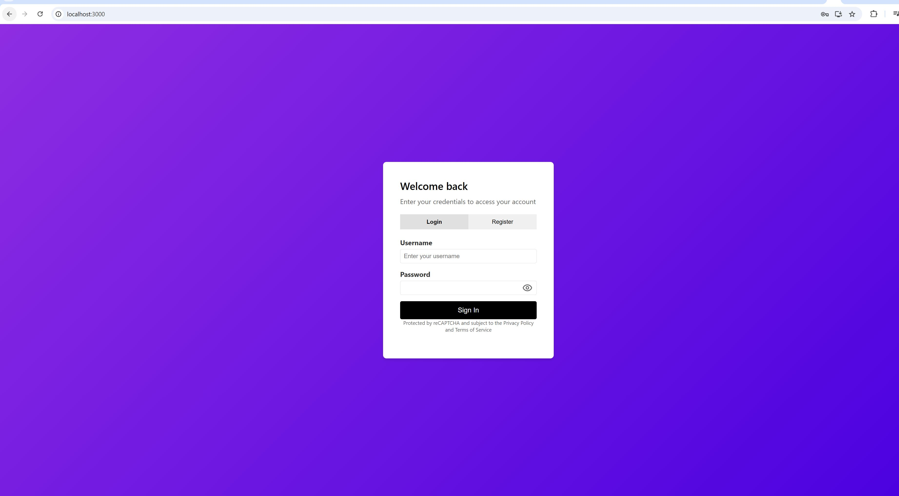
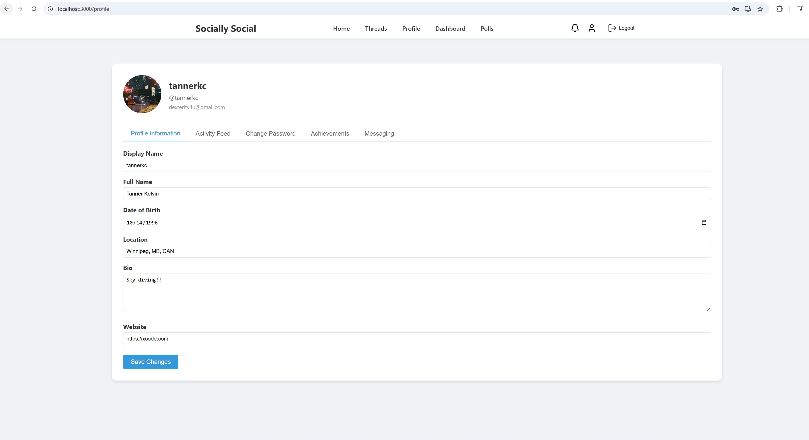
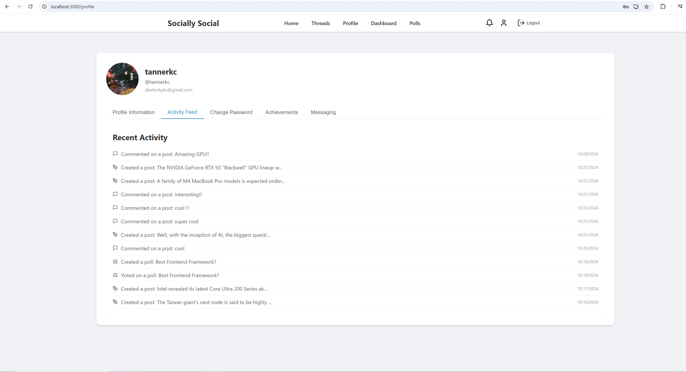
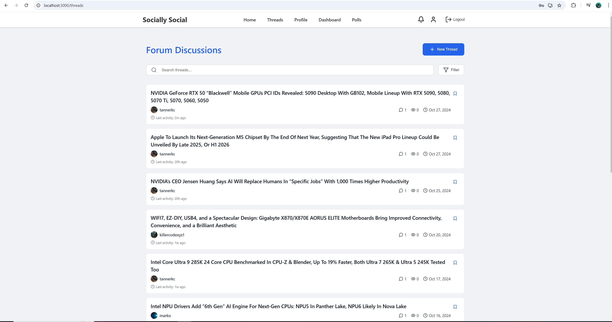
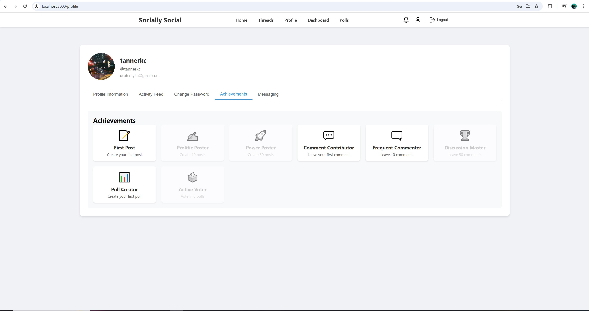

# Author: Thomas Eruchie

# Social Media Application

A full-featured social media platform built with React.js and Node.js, featuring real-time messaging, polls, achievements, and more.

## Table of Contents

- [Overview](#overview)
- [Features](#features)
- [Technology Stack](#technology-stack)
- [Getting Started](#getting-started)
  - [Prerequisites](#prerequisites)
  - [Installation](#installation)
  - [Environment Setup](#environment-setup)
- [Architecture](#architecture)
- [Core Features](#core-features)
- [API Documentation](#api-documentation)
- [Security](#security)
- [Performance Optimizations](#performance-optimizations)
- [Contributing](#contributing)
- [License](#license)

## Overview

This social media application provides a comprehensive platform for user interaction, content sharing, and community engagement. It includes features like real-time messaging, post creation with rich text and image support, polling system, achievement tracking, and more.

## Features

### User Management
- User registration and authentication
- JWT-based session management
- Profile customization with avatars
- Social media links integration
- Achievement system
- Activity tracking
- Custom display names
- Bio and personal information management

### Content Management
- Rich text post creation with image support
- Multi-image upload capability (up to 5 images per post)
- Post editing and deletion
- Comment system
- Like/Unlike functionality
- Search functionality
- Infinite scroll for content loading

### Messaging System
- Real-time private messaging
- Thread-based conversations
- File attachments support
- Quick reply templates
- Unread message tracking
- Draft message support

### Forum Features
- Thread creation and management
- Category-based organization
- Post tracking within threads
- Thread locking/unlocking
- Thread pinning
- Last activity tracking

### Polling System
- Create polls with multiple options
- Vote tracking
- Expiration date setting
- Results visualization
- Vote protection (one vote per user)

### Achievement System
- Automatic achievement tracking
- Multiple achievement categories
- Progress tracking
- Achievement notifications
- Custom achievement icons

### Dashboard & Analytics
- User activity visualization
- Statistical data representation using Recharts
- Performance metrics
- User engagement tracking

## Technology Stack

### Frontend
- React.js 17.0.2
- React Router DOM 6.26.2
- Axios for API communication
- React Quill for rich text editing
- React Dropzone for file uploads
- React Infinite Scroll Component
- React Window for virtualized lists
- Recharts for data visualization
- Tailwind CSS for styling
- DOMPurify for XSS protection

### Backend
- Node.js
- Express.js
- MongoDB with Mongoose
- JWT for authentication
- Multer for file uploads
- bcrypt for password hashing
- CORS support

## Getting Started

### Prerequisites

- Node.js (v12 or higher)
- MongoDB (v4.4 or higher)
- npm or yarn package manager

### Installation

1. Clone the repository:

bash
git clone <repository-url>
cd <project-directory>

2. Install frontend dependencies:

bash
cd frontend
npm install

3. Install backend dependencies:

bash
cd backend
npm install

### Environment Setup

1. Create `.env` file in the api directory:

env
MONGODB_URI=mongodb+srv://<username>:<password>@<cluster-url>
JWT_SECRET=your-jwt-secret
PORT=8080

env
REACT_APP_API_URL=http://localhost:8080

3. Start the development servers:

Backend:
cd api
npm run dev

Frontend:
cd frontend
npm start

## Architecture

### Frontend Architecture

The frontend follows a component-based architecture with the following structure:

frontend/
├── public/
├── src/
│ ├── components/
│ │ ├── auth/
│ │ ├── posts/
│ │ ├── messages/
│ │ └── polls/
│ ├── context/
│ ├── hooks/
│ ├── services/
│ ├── utils/
│ └── App.js

### Backend Architecture

The backend follows a modular architecture with clear separation of concerns:

api/
├── config/
├── middleware/
├── models/
├── routes/
├── uploads/
└── index.js

## Core Features Breakdown

### Authentication System
- JWT-based authentication
- Token refresh mechanism
- Session management
- Password hashing with bcrypt
- Protected routes

### Post Management
- Rich text editor integration
- Image compression before upload
- Lazy loading of images
- Comment threading
- Real-time updates

### Message System
- Real-time message delivery
- Message status tracking
- File attachment support
- Thread management
- Draft system

### Achievement System
- Automatic achievement tracking
- Custom achievement definitions
- Progress tracking
- Notification system

## API Documentation

### Authentication Endpoints

POST /api/auth/register - User registration
POST /api/auth/login - User login

### Post Endpoints
GET /api/posts - Get all posts
POST /api/posts - Create new post
PUT /api/posts/:id - Update post
DELETE /api/posts/:id - Delete post

### Message Endpoints
GET /api/messages/inbox - Get inbox messages
POST /api/messages - Send new message
GET /api/messages/unread-count - Get unread count

### Poll Endpoints
GET /api/polls - Get all polls
POST /api/polls - Create new poll
PUT /api/polls/:id/vote - Vote on poll

## Security Measures

1. Input Sanitization
- DOMPurify for HTML content
- Input validation on both frontend and backend
- XSS protection

2. Authentication Security
- JWT token management
- Password hashing
- Session handling

3. File Upload Security
- File type validation
- Size restrictions
- Compression implementation

## Performance Optimizations

1. Image Optimization
- Compression using Compressorjs
- Lazy loading implementation
- Thumbnail generation

2. React Optimizations
- Lazy loading components
- Memo usage for performance
- Virtual scrolling implementation

3. API Optimizations
- Request caching
- Rate limiting
- Response compression

## Contributing

1. Fork the repository
2. Create your feature branch
3. Commit your changes
4. Push to the branch
5. Create a Pull Request

### Coding Standards
- Use ESLint configuration
- Follow React best practices
- Maintain component structure
- Write meaningful commit messages

## Deployment

### Frontend Deployment
1. Build the production version:
bash
npm run build

2. Serve the static files using a web server

### Backend Deployment
1. Set up environment variables
2. Configure MongoDB connection
3. Set up reverse proxy
4. Enable SSL/TLS

## Troubleshooting

### Common Issues

1. OpenSSL Legacy Provider
- Issue: Node.js compatibility with React Scripts
- Solution: Using legacy provider flag in npm scripts

2. CORS Issues
- Check CORS configuration in backend
- Verify API URL in frontend config

3. Image Upload Issues
- Verify file size limits
- Check compression settings
- Ensure proper MIME type handling

### Performance Issues
- Implement lazy loading
- Use pagination
- Optimize database queries
- Monitor memory usage

## Screenshots

### Authentication

*Secure authentication system with clean, modern interface*

### User Profile

*Comprehensive profile management with customizable user details*

### Activity Feed

*Chronological display of user activities and engagement history*

### Messaging System

*Real-time messaging system with thread management and file attachment support*

### Social Posts

*Interactive news feed with rich media support and engagement features*

### Forum Threads

*Organized forum discussions with filtering and search capabilities*

### Thread View

*Comprehensive thread view with rich text editor and image upload support*

### Achievement System

*Gamified achievement system tracking user milestones and contributions*

## License

This project is licensed under the ISC License.

## Contributing

1. Fork the repository
2. Create your feature branch (`git checkout -b feature/AmazingFeature`)
3. Commit your changes (`git commit -m 'Add some AmazingFeature'`)
4. Push to the branch (`git push origin feature/AmazingFeature`)
5. Open a Pull Request

## License

This project is licensed under the ISC License - see the LICENSE file for details.

## Acknowledgments

- React.js team for the amazing frontend library
- Node.js community for the robust backend runtime
- MongoDB team for the flexible database solution
- All contributors who have helped shape this project

---

For more information or support, please open an issue in the repository.
